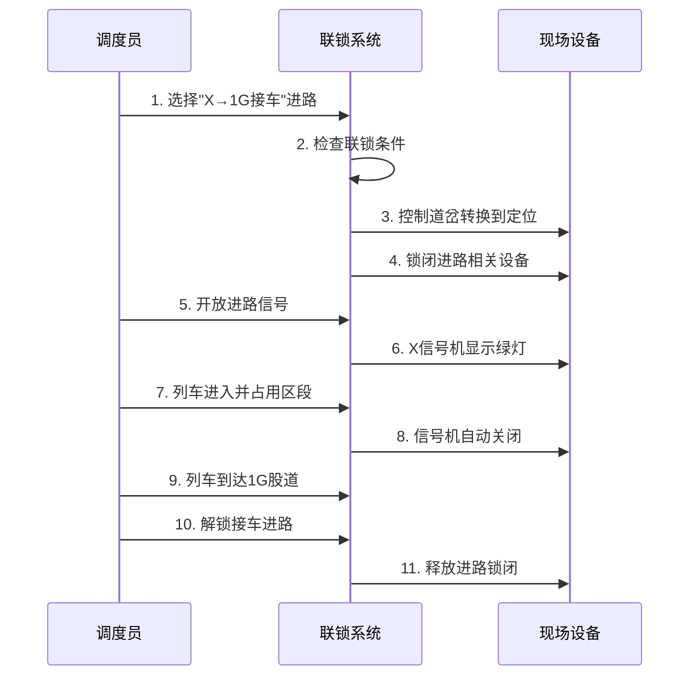

# 计算机联锁模拟仿真系统 - 功能演示

## 系统概述

本系统是一个专业的铁路计算机联锁模拟仿真系统，完整实现了铁路车站的核心安全功能：

- ✅ **联锁安全逻辑** - 完整的进路联锁、道岔联锁、信号联锁
- ✅ **实时图形化界面** - 基于SVG的站场图，实时显示设备状态
- ✅ **多模块协同** - 进路、道岔、信号、列车统一管理
- ✅ **操作日志追踪** - 完整记录所有系统操作
- ✅ **数据持久化** - LocalStorage本地存储，刷新不丢失状态

## 快速体验指南

### 第一步：系统启动
1. 运行 `npm run dev` 启动开发服务器
2. 浏览器打开 `http://localhost:5173`
3. 系统自动加载，显示专业的联锁操作界面

### 第二步：认识界面布局

```
┌─────────────────────────────────────────────────────────┐
│  计算机联锁模拟仿真系统                     [正常运行] [紧急停车] │
├─────────────────────────────────────────────────────────┤
│                                          │              │
│           站场示意图                        │   控制面板     │
│    ┌─────────────────────────┐            │              │
│    │  X──1IAG──D1──1G──D2──S │            │ ┌─进路控制─┐  │
│    │      └─D1──3G──┘        │            │ ├─道岔控制─┤  │
│    │        └─1SG─┘          │            │ ├─信号控制─┤  │
│    └─────────────────────────┘            │ ├─列车管理─┤  │
│                                          │ └─系统监控─┘  │
├─────────────────────────────────────────────────────────┤
│ 活动进路:0  占用区段:0  在线列车:0      2024-01-15 14:30:25 │
└─────────────────────────────────────────────────────────┘
```

### 第三步：基础操作演示

#### 3.1 道岔操作演示
1. 点击"道岔控制"标签页
2. 选择道岔"D1"
3. 选择目标位置"反位"  
4. 点击"操作"按钮
5. 观察站场图中道岔状态变化（绿色圆点变为橙色）

#### 3.2 进路建立演示
1. 点击"进路控制"标签页
2. 找到"X→1G接车"进路
3. 点击"选排锁闭"按钮
4. 观察变化：
   - 道岔D1自动转换到定位
   - 相关区段变为黄色（锁闭状态）
   - 活动进路列表增加一条记录

#### 3.3 信号开放演示
1. 在活动进路中找到刚建立的进路
2. 点击"开放"按钮
3. 观察信号机X变为绿灯
4. 进路状态变为"开放"

#### 3.4 列车运行演示
1. 点击"列车管理"标签页
2. 输入车次"K1234"
3. 选择初始位置"X"
4. 点击"添加列车"
5. 观察站场图出现红色列车图标
6. 选择列车"K1234"
7. 选择目标区段"1G"
8. 点击"模拟运行"
9. 观察列车从X区段移动到1G区段

## 高级功能演示

### 联锁安全演示

#### 演示1：敌对进路检测
1. 建立"X→1G接车"进路并开放
2. 尝试建立"X→3G接车"进路
3. 系统显示错误："存在敌对进路，无法选排"
4. 这证明了联锁系统的安全保护功能

#### 演示2：道岔安全保护
1. 保持"X→1G接车"进路锁闭状态
2. 尝试单独操作道岔D1
3. 系统显示："道岔D1被进路锁闭，无法操作"
4. 这确保了进路锁闭期间设备安全

#### 演示3：区段占用检测
1. 在1G区段添加列车
2. 尝试解锁包含1G的进路
3. 系统显示："进路区段仍有列车占用，无法解锁"
4. 只有列车出清后才能解锁进路

### 故障模拟演示

#### 道岔故障模拟
1. 进入"道岔控制"标签页
2. 在"故障模拟"区域选择道岔D1
3. 点击"设置故障"
4. 观察道岔在站场图中变为灰色
5. 尝试操作该道岔，系统提示故障无法操作

#### 信号故障模拟
1. 进入"信号控制"标签页  
2. 在"信号机故障模拟"区域选择信号机X
3. 点击"设置故障"
4. 观察信号机强制显示红灯并锁定

### 系统监控演示

#### 操作日志查看
1. 点击"系统监控"标签页
2. 在操作日志中查看所有历史操作
3. 可以按操作类型筛选日志
4. 支持导出CSV格式的日志文件

#### 设备状态统计
1. 查看"设备状态统计"表格
2. 显示道岔、信号机、轨道区段的正常/异常数量
3. 实时计算设备正常率
4. 用进度条直观显示系统健康度

#### 数据备份与恢复
1. 点击"备份数据"下载系统状态文件
2. 点击"恢复数据"上传之前的备份
3. 支持完整的系统状态恢复

## 典型作业流程演示

### 完整的列车接车作业



### 操作步骤详解：

1. **进路选排** 🚦
   - 选择"X→1G接车"进路
   - 系统自动检查道岔位置
   - 道岔D1自动转换到定位

2. **进路锁闭** 🔒
   - 锁闭X、1IAG、1G区段
   - 锁闭道岔D1
   - 防止其他操作干扰

3. **信号开放** 🟢  
   - X信号机显示绿灯
   - 列车获得进站许可

4. **列车运行** 🚂
   - 列车进入X区段
   - 逐步占用1IAG、1G区段
   - 信号机自动关闭

5. **进路解锁** 🔓
   - 列车完全到达1G
   - 前方区段出清
   - 系统解除进路锁闭

## 系统特色功能

### 1. 右键交互菜单
- 在站场图上右键点击
- 弹出上下文菜单
- 快速添加/移除列车
- 切换区段占用状态

### 2. 自动运行模式
- 启动列车自动运行
- 可调节运行间隔
- 模拟真实的列车运行场景

### 3. 实时状态更新
- 所有操作实时同步到界面
- 设备状态颜色变化
- 底部状态栏实时更新

### 4. 数据持久化
- 所有操作自动保存到LocalStorage
- 刷新页面数据不丢失
- 支持手动备份和恢复

## 技术亮点

### 前端技术栈
- **Vue 3** - 最新的渐进式框架
- **Composition API** - 更好的逻辑复用
- **Pinia** - 现代化状态管理
- **Element Plus** - 企业级组件库

### 核心算法
- **联锁逻辑引擎** - 实现铁路安全规则
- **状态机管理** - 设备状态转换控制
- **冲突检测算法** - 进路敌对关系判断
- **实时数据同步** - 多组件状态协调

### 用户体验
- **响应式设计** - 适配不同屏幕
- **直观的图形界面** - SVG矢量图形
- **丰富的交互反馈** - 操作提示和确认
- **完整的错误处理** - 友好的错误提示

## 总结

这个计算机联锁模拟仿真系统完整实现了铁路车站的核心功能，不仅具有专业的技术水准，还提供了出色的用户体验。通过这个系统，用户可以：

- 🎯 **学习铁路联锁原理** - 通过实际操作理解联锁逻辑
- 🔧 **练习设备操作** - 熟悉道岔、信号、进路操作
- 📊 **分析系统行为** - 观察联锁系统的安全保护机制
- 🚀 **体验现代技术** - 感受Vue 3生态的强大能力

系统设计遵循了铁路行业标准，实现了完整的安全联锁逻辑，是一个优秀的教学和演示平台。 